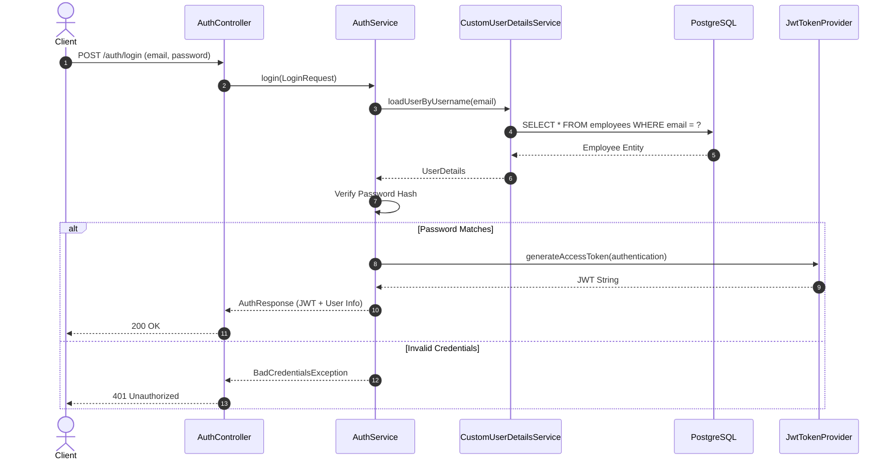
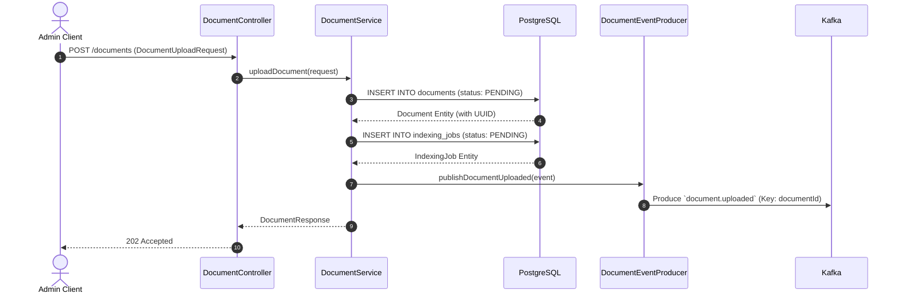
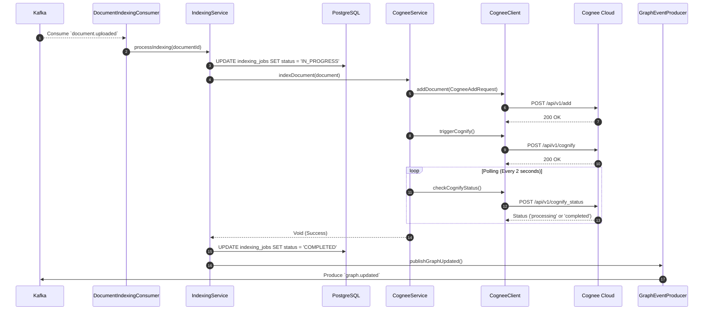
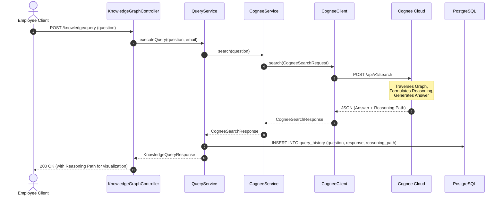
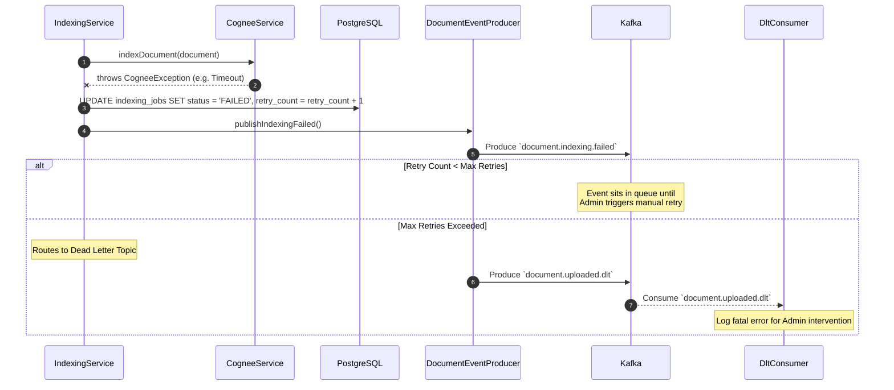

# Sequence Diagrams

This document contains Mermaid sequence diagrams illustrating the exact step-by-step interactions between system components for the core workflows of the Knowledge Nexus (corp-KRC) platform.

---

## 1. Authentication (User Login)

**Participants:**
- **Client:** The React frontend application.
- **AuthController:** The REST endpoint receiving the request.
- **AuthService:** Orchestrates the authentication logic.
- **CustomUserDetailsService:** Loads the user from the database.
- **PostgreSQL:** The database storing employee credentials.
- **JwtTokenProvider:** Utility that generates signed JWTs.

---

## 2. Upload Document & Kafka Processing

**Participants:**
- **Admin Client:** The React frontend (Admin Portal).
- **DocumentController:** REST endpoint receiving the document payload.
- **DocumentService:** Handles database persistence and event publishing.
- **PostgreSQL:** Stores the raw document and indexing status.
- **DocumentEventProducer:** Kafka producer wrapper.
- **Kafka:** The message broker.

---

## 3. Cognee Indexing & Graph Update

**Participants:**
- **Kafka:** Message broker delivering the event.
- **DocumentIndexingConsumer:** Listens to the `document.uploaded` topic.
- **IndexingService:** Orchestrates the AI pipeline.
- **PostgreSQL:** Tracks job status.
- **CogneeService:** Business logic layer for Cognee interactions.
- **CogneeClient:** Anti-corruption layer (HTTP client).
- **Cognee Cloud:** The external AI engine and Knowledge Graph.
- **GraphEventProducer:** Publishes the final success event.

---

## 4. Employee Query & Knowledge Graph Retrieval

**Participants:**
- **Employee Client:** React frontend (User Portal).
- **KnowledgeGraphController:** REST endpoint receiving the question.
- **QueryService:** Business logic for query tracking.
- **CogneeService:** Wraps query logic for AI.
- **CogneeClient:** HTTP client.
- **Cognee Cloud:** AI Engine traversing the graph.
- **PostgreSQL:** Stores audit logs of queries.

---

## 5. Document Failure Flow

**Participants:**
- **IndexingService:** Encounters an error during processing.
- **CogneeService:** Throws an exception.
- **PostgreSQL:** Stores failure state and retry count.
- **DocumentEventProducer:** Publishes failure events.
- **Kafka (DLT):** Dead Letter Topic for unrecoverable errors.
- **DltConsumer:** Logs the fatal error.

