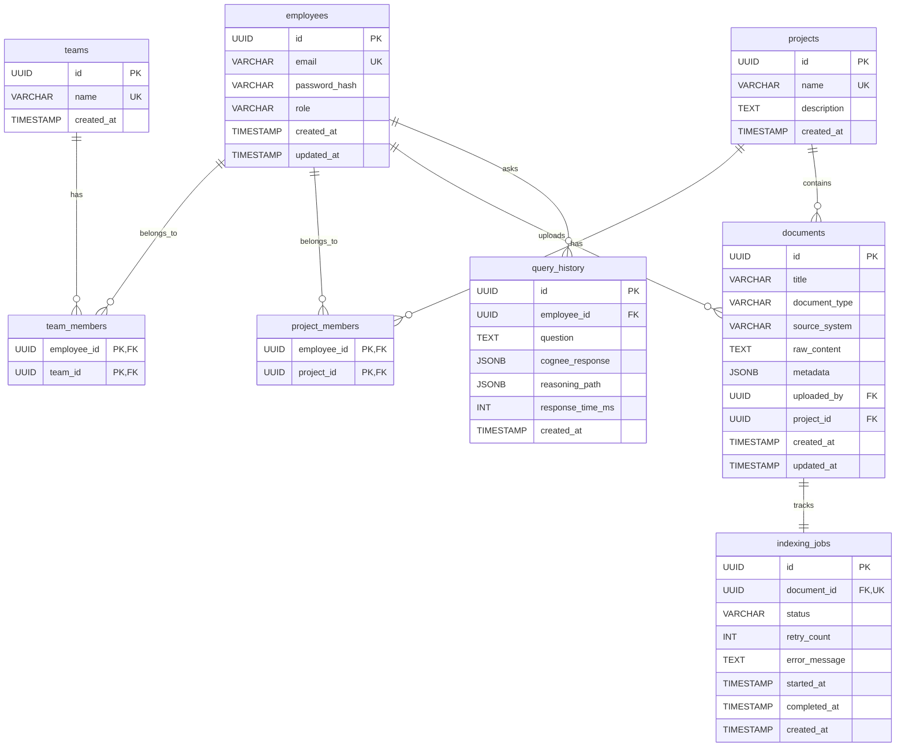

# Database Schema Design (PostgreSQL)

## Why PostgreSQL over MongoDB?

The decision to use PostgreSQL as the sole database for the Knowledge Nexus platform—expressly avoiding MongoDB—was driven by the need for strict relational integrity combined with schema flexibility. 

- **ACID Compliance & Relationships:** The platform handles heavily structured business entities (Employees, Teams, Projects) where data integrity, foreign key constraints, and transactional consistency are paramount. MongoDB's document model weakens these guarantees.
- **JSONB Capabilities:** PostgreSQL's `JSONB` data type allows us to store unstructured document bodies, arbitrary metadata, and flexible AI reasoning payloads (from Cognee) within the same database as our structured data. We get the flexibility of NoSQL without sacrificing relational joins.
- **Single Source of Truth:** Introducing MongoDB alongside PostgreSQL would create a distributed data problem. A single PostgreSQL instance vastly simplifies backups, transactions, migrations, and the overall backend architecture.

---

## Complete ER Diagram

---

## Entity Definitions & Design Decisions

### 1. `employees`
**Purpose:** Core user entity for authentication and attribution.
- **Key Columns:** `email` (Unique), `password_hash`, `role` (ADMIN, EMPLOYEE).
- **Design Decision:** The `role` is stored as a simple string/enum rather than a separate table because the RBAC model is strictly bounded to these two tiers. This avoids unnecessary joins during the authentication filter chain.

### 2. `teams` & `projects`
**Purpose:** Organizational grouping entities.
- **Key Columns:** `name` (Unique).
- **Design Decision (Normalization):** We use explicit join tables (`team_members`, `project_members`) rather than arrays of UUIDs. This strict 3NF normalisation allows for complex future queries (e.g., "Find all documents uploaded by members of Team A working on Project B") while enforcing referential integrity.

### 3. `documents`
**Purpose:** The central repository for all enterprise knowledge ingested into the system.
- **Key Columns:** `title`, `document_type` (Enum), `source_system` (e.g., Confluence, Jira, GDrive).
- **Foreign Keys:** `uploaded_by` (Employee), `project_id` (Project - Nullable).
- **JSONB Usage (`metadata`):** Stores arbitrary key-value pairs associated with the document (e.g., Jira ticket tags, Confluence space IDs, author lists) which differ wildly depending on the `source_system`.
- **Text Usage (`raw_content`):** Stores the extracted text. This is kept in Postgres so the backend always has a source of truth to reconstruct or re-index data if the Cognee graph is wiped.
- **Design Decision:** Frequently queried metadata (like `document_type` or `uploaded_by`) are strictly defined as standard columns for fast indexing, while the `JSONB` column is reserved for flexible, less frequently queried attributes.

### 4. `indexing_jobs`
**Purpose:** Asynchronous tracking of AI processing.
- **Key Columns:** `status` (PENDING, IN_PROGRESS, COMPLETED, FAILED), `retry_count`, `error_message`.
- **Foreign Keys:** `document_id` (One-to-One).
- **Design Decision:** We separate `indexing_jobs` from `documents`. The `documents` table represents the immutable business asset. The `indexing_jobs` table represents ephemeral, stateful processing logic. Separating them prevents locking contention and keeps the `documents` table clean.

### 5. `query_history`
**Purpose:** Auditing and metrics for the AI reasoning engine.
- **Key Columns:** `question`, `response_time_ms`.
- **Foreign Keys:** `employee_id`.
- **JSONB Usage (`cognee_response`, `reasoning_path`):** Cognee returns dynamic graph structures (nodes, edges, weights) representing how it arrived at an answer. Because this structure may evolve as Cognee updates its algorithms, it is persisted directly as `JSONB`.
- **Design Decision:** This table is append-only. It serves as a historical log for admins to monitor AI accuracy, latency (`response_time_ms`), and usage patterns.

---

## Constraints, Foreign Keys & Relationships

- **Primary Keys:** All tables use `UUID` generated by the backend (or PostgreSQL `uuid-ossp`) to ensure global uniqueness and make API endpoints obfuscated against scraping (no sequential IDs).
- **Foreign Keys:** 
  - Strict `ON DELETE RESTRICT` constraints for things like `uploaded_by`. You cannot delete an employee if they own documents. 
  - `ON DELETE CASCADE` for join tables (`team_members`, `project_members`). If a project is deleted, its membership associations vanish automatically.
- **Unique Constraints:** `employees.email`, `teams.name`, `projects.name`.

---

## Indexing Strategy

Indexes are applied strategically to avoid write-penalties on heavily inserted tables.

1. **Frequently Queried Columns:**
   - `idx_documents_project_id`: Fast filtering of documents by project.
   - `idx_documents_type`: Fast filtering for UI dashboards.
   - `idx_query_history_employee_id`: For employees retrieving their chat history.
   - `idx_indexing_jobs_status`: Crucial for the Admin Dashboard to quickly find `FAILED` or `PENDING` jobs.

2. **JSONB Indexing:**
   - A GIN (Generalized Inverted Index) is applied to `documents.metadata` to allow highly performant queries inside the JSON structure (e.g., finding all documents where `metadata->>'author' = 'John'`) without full table scans.

## Summary

This schema strictly adheres to Enterprise relational standards where it matters (identity, relationships, access control), while fully embracing PostgreSQL's `JSONB` to handle the unstructured chaos of raw enterprise data and dynamic AI graph responses.
