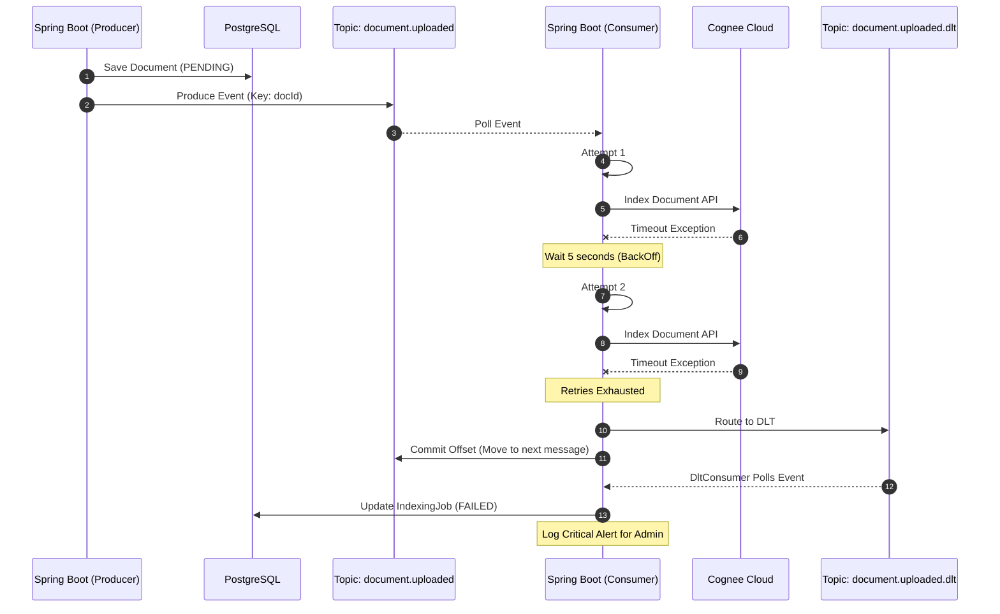

# Kafka Event Architecture

## Why Kafka?
Knowledge Nexus (corp-KRC) integrates with Cognee Cloud for heavy AI indexing and graph construction. These processes are inherently slow, unpredictable in duration, and computationally expensive. 

Kafka was chosen as the message broker because it provides:
1. **Asynchronous Decoupling:** The Spring Boot backend can acknowledge document uploads instantly while pushing the actual processing to the background.
2. **Durability:** Events are persisted to disk. If the Spring Boot application or Cognee crashes, no documents are lost; processing resumes from the last committed offset.
3. **Replayability:** If an indexing bug is discovered, Kafka allows us to reset consumer offsets and re-process historical events.
4. **Horizontal Scalability:** Consumer groups allow us to effortlessly scale the indexing throughput by simply adding more backend nodes.

## Event Catalog & Topics

| Topic Name | Producer | Consumer | Purpose |
| :--- | :--- | :--- | :--- |
| `document.uploaded` | `DocumentService` | `IndexingService` | Signals that a document is saved in PostgreSQL and ready for Cognee ingestion. |
| `graph.updated` | `IndexingService` | `NotificationService` (TBD) | Signals that Cognee has successfully constructed the knowledge graph for a document. |
| `document.uploaded.dlt` | `IndexingService` | `DltConsumer` | Captures events that failed processing after all retries were exhausted (Dead Letter Topic). |

## Responsibilities

### Producer Responsibilities
- **Transaction Safety:** Producers must only publish an event *after* the primary database transaction has successfully committed (or as part of a transactional outbox, if strict exactly-once semantics are needed in the future).
- **Payload Construction:** Map internal domain entities into standardized `BaseEvent` JSON payloads.

### Consumer Responsibilities
- **Delegation:** Consumers must not contain business logic. They exist solely to parse the JSON event and route the payload to the appropriate `@Service` class.
- **Idempotency:** Because Kafka guarantees "at least once" delivery, consumers (or the services they call) must be idempotent. Processing the same `document.uploaded` event twice must not corrupt the database or create duplicate nodes in Cognee.

## Message Payload Philosophy
**"Thin Events" (Notification-Driven)**
Events in this system carry *identifiers*, not full document payloads. 
Instead of sending a 5MB text document through Kafka, the event carries the `documentId`. The consumer then queries PostgreSQL to fetch the latest state of the document. This prevents Kafka from being bogged down by large payloads and avoids stale data race conditions.

## Failure Handling & Retry Policy

1. **Transient Errors (e.g., Cognee Network Timeout):** 
   - Handled via Spring Kafka's built-in `DefaultErrorHandler` and `FixedBackOff`.
   - The consumer will automatically retry processing the message (e.g., 3 retries, 5 seconds apart).
2. **Persistent Errors (e.g., Invalid JSON, Cognee 400 Bad Request):**
   - If all retries fail, the event is considered "poisoned".
3. **Dead Letter Queue (DLT):**
   - Poisoned messages are routed to the `document.uploaded.dlt` topic.
   - The original topic continues processing subsequent messages without being blocked.
   - The `DltConsumer` listens to the DLT, logs a critical alert, and updates the `IndexingJob` status in PostgreSQL to `FAILED`.

## Ordering Guarantees

- Kafka guarantees strict ordering **only within a single partition**.
- We ensure order by using the `documentId` as the Kafka message **Key**. 
- This guarantees that all events related to the *same* document are routed to the *same* partition, ensuring they are processed sequentially by the consumer.

## Scaling Consumers

The `knowledge-nexus-indexing-group` consumer group handles ingestion. 
If indexing becomes a bottleneck:
1. Increase the number of partitions on the `document.uploaded` topic.
2. Deploy more instances of the Spring Boot backend. 
3. Kafka will automatically rebalance the partitions across the available consumers, instantly parallelizing the AI ingestion workload.

## Monitoring

Kafka health and event lag must be monitored to ensure the system is processing documents efficiently.
- **Consumer Lag:** Monitored via JMX or Kafka Exporter. High lag indicates Cognee is processing slower than users are uploading.
- **DLT Volume:** An alert must be triggered if the DLT receives messages, as this indicates complete processing failures requiring human intervention.

---

## Event Lifecycle (Sequence Diagram)

This diagram illustrates the lifecycle of a document event, from production through consumption, including the failure path to the DLT.

